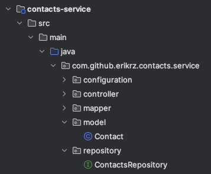

# java-restful-spring-workshop

Hola, bienvenidos a este workshop donde aprenderás los conceptos básicos para crear microservicios RESTful en Java con Spring.
Los microservicios son software pequeño, independiente, que cumplen una función única, con una interfaz de comunicación 
ligera, y que son la columna vertebral de los sistemas actuales. 

Para este workshop, necesitas tener una noción básica de java, y una computadora con el siguiente software instalado:
* Un **Java 17 JDK** (Java Development Kit, Kit de desarrollo de Java). Por ejemplo, [Amazon Coretto](https://docs.aws.amazon.com/corretto/latest/corretto-17-ug/downloads-list.html).
* Un **IDE** (Integrated Development Environment, entorno integrado de desarrollo) que soporte Java. Por ejemplo, 
  [IntelliJ Idea](https://www.jetbrains.com/idea/download/other.html). La versión **ultimate** es la más completa y puedes probarla por 30 días. Si eres estudiante, 
  puedes pedir una licencia por un año con el email de tu institución. La versión **community** no tiene mucho soporte para 
  Spring, pero es siempre gratuita. 
* Un navegador web (Firefox, Chrome, Edge, Safari)

## Temario

* API
  * Qué significa API, REST, RESTful?
  * Manos a la obra: Swagger, OpenAPI y Spring Web.

* Persistencia
  * Qué es la persistencia?
  * Manos a la obra: Spring Repositories and Models.

* Servicio
  * ¿Cómo comunico mi capa REST con mi capa de Persistencia?
  * Manos a la obra: Lógica de negocio, mapeadores.

* Pruebas
  * ¿Cómo sé que mi aplicación funciona, o que va a seguir funcionando después de hacer un cambio?
  * Manos a la obra: pruebas unitarias con JUnit y AssertJ.

* Contenido extra
    * ¿Cómo le hago para que otro programa Java funja como cliente para mi API RESTful?
    * Manos a la obra: Crear un cliente con Feign.
    * ¿Cómo hago un cliente fácil que sea configurable, pero listo para usar?
    * Manos a la obra: Mejorar el cliente con Spring Boot Starter.

## API

### Qué significa API, REST, RESTful?

Una **API** (Application Programming Interface, interfaz de programación de aplicaciones) es un contrato, 
que define cómo se comunican entre sí 2 aplicaciones, mediante solicitudes y respuestas, y cómo se deben de estructurar. 
A esas 2 aplicaciones, usualmente se les llama **cliente** y **servidor**. 
La aplicación que envía la solicitud se llama **cliente**, y la que envía la respuesta se llama **servidor**.

Actualmente hay una variedad de APIs: **SOAP**, **RPC**, **WebSocket**, **REST**. En este workshop nos vamos a enfocar en desarrollar 
una **API REST**.

Una **API REST** (REpresentational State Transfer, transferencia de estado representacional) se basa en el protocolo **HTTP** (Hyper Text Transfer Protocol, Protocolo de Transferencia de Híper Texto).
Fue diseñado para poder describir o representar el estado de un objeto o recurso, y éste se pudiera comunicar entre sistemas. 
El protocolo HTTP define **métodos** basados en verbos: **GET** (obtener), **POST** (publicar), **PUT** (poner), 
**DELETE** (eliminar).
Cada mensaje que el cliente manda al servidor, tiene que declarar la intención de su acción, usando el método HTTP adecuado.  

**RESTful** es una manera ya estandarizada de cómo implementar una API REST, de manera que facilita crear y mantener servicios web a los desarrolladores.
Provee una interfaz uniforme para acceder a los recursos.

### Manos a la obra: Swagger, OpenAPI y Spring Web.

Descarga el código base para este workshop desde este [enlace de github](https://github.com/erikrz/java-restful-spring-workshop/tree/release/0.0.1-ALPHA).
Asegúrate de descargar o clonar la versión de la rama **release/0.0.1-ALPHA**.
Si optas por descargar el archivo, se llamará **java-restful-spring-workshop-release-0.0.1-ALPHA.zip**

Una vez descomprimido o clonado, deberás tener una carpeta así:

Esta carpeta deberás abrirla con el IDE con soporte de Java que debes tener ya instalado en tu computadora.

Una vez abierto el folder, `/java-restful-spring-workshop`, verás las siguientes carpetas dentro del proyecto:

* [Carpeta padre](..)
    * [contacts-api](../contacts-api)
      Define el contrato RESTful y los DTOs (Data Transfer Objects, Objetos de transferencia de datos) usados para comunicarse con el servicio de contactos.
    * [contacts-client](../contacts-client)
      Define un cliente de Feign para un programa Java cliente, pueda comunicarse fácilmente con el servicio de contactos.
    * [contacts-client-spring-boot-starter](../contacts-client-spring-boot-starter)
      Define un cliente de Feign listo para usar para programas Java clientes que ya usan Spring Boot.
    * [contacts-service](../contacts-service)
      El microservicio como tal.

Primero veamos cómo se ve un documento de especificación OpenAPI en formato JSON, que es probablemente el que más conozcan. También se puede realizar en YAML.

Abrimos [swagger.json](swagger.json) y veamos cómo se renderiza en IntelliJ IDEA, el cual tiene un plugin llamado `OpenAPI Specifications`.

Ahora veamos lo que contiene **contacts-api**

Tiene 2 carpetas:

| DTO                                                                                                                                                              | Contract                                                                                                                                                                                                                                                                                  |
|------------------------------------------------------------------------------------------------------------------------------------------------------------------|-------------------------------------------------------------------------------------------------------------------------------------------------------------------------------------------------------------------------------------------------------------------------------------------|
| Los DTOs (Data Transfer Objects, Objetos de transferencia de datos) son clases especiales creadas para el propósito específico de definir cómo transmitir datos. | Los contratos definen todas las operaciones que ofrece la API a los clientes. A partir de ellos, se puede generar un documento que sigue el standard `OpenAPI` y que se puede exponer mediante Swagger para tener una UI intuitiva para explorar la `API`.                                |
| Se clasifican en `request` y de `response` dependiendo su uso. También se pueden definir casos especiales en caso de ser necesario, i.e. mensajes de error.      | Las Operaciones idempotentes son aquellas que no importa cuantas veces las ejecutes, nada cambia en el servidor. Las operaciones no idempotentes, son aquellas que, si las ejecutas varias veces, cada ejecución implica potencialmente un cambio en los recursos que ofrece el servidor. |
| Contienen anotaciones `@Schema`. Estas nos ayudan a documentar los campos y proveer ejemplos de datos válidos.                                                   | Contienen anotaciones `@Operation` con la cual podemos describir cómo se va a comportar nuestra API en distintos escenarios, y `@Parameter` para indicar los parámetros que recibirán los endpoints.                                                                                      |
| Contienen anotaciones `@NotBlank`, `@Email`. Estas nos ayudan a validar los datos de entrada dentro de un objeto POJO.                                           | Contienen anotaciones `@Valid` con la cual indicamos que antes de ingresar a ese método, el Objeto anotado debe ser validado.                                                                                                                                                             |

Todo esto que acabamos de ver es la definición de la api, el contrato. 

Ahora, veamos lo que contiene **contacts-service**, específicamente, el package `com.github.erikrz.contacts.service.controller` [aquí](../contacts-service/src/main/java/com/github/erikrz/contacts/service/controller) 

| Contacts controller                                                                                                                                                                                                                                                                                                                   |
|---------------------------------------------------------------------------------------------------------------------------------------------------------------------------------------------------------------------------------------------------------------------------------------------------------------------------------------|
| Tiene las anotaciones de Spring `@RestController` que indica que lo que regresen los métodos, va a ser tratados como el campo `body` de las respuestas a las peticiones al servidor, y `@RequestMapping` indica un path común para todos los métodos dentro del controller.                                                           |
| Verán que la clase `implements ContactsIdempotentOperations, ContactsNonIdempotentOperations`, es decir, implementa las operaciones definidas en el contrato. Por esta misma razón verán `@Override` arriba de todos los métodos implementados, y verán que la anotación `@ResponseStatus` corresponde a lo declarado en el contrato. |
| El resto de anotaciones de Spring le dan indicaciones a Spring de cómo manejar las peticiones, por ejemplo, `@PostMapping`, `@GetMapping`, `@PutMapping`, `@DeleteMapping`, `@RequestBody`, `@PathVariable`.                                                                                                                          |

En fin, demasiada explicación. Intentemos ahora ejecutar el servicio.

Iniciamos el servicio como se menciona en el archivo [README.md](../README.md#starting-the-application) en la raíz de este proyecto. Luego, nos dirigiremos a esta ruta
[localhost:8080/swagger-ui.html](http://localhost:8080/swagger-ui.html)

Siéntete libre de experimentar con Swagger.

## Persistencia

### Qué es la persistencia?

La persistencia es la capacidad que tiene un objeto de perdurar fuera del proceso que lo creó, permitiendo ser recuperado en un futuro.

Como se habrán dado cuenta, el servicio responde con datos falsos, también llamados "fake" o "mocks".
Esto es porque este servicio aún no tiene conectada la capa de controlador, con la capa de persistencia.
Veamos primero cómo se implementa esta capa donde se persisten los datos. Para este ejemplo, usaremos una base de datos llamada `H2`.

Veamos lo que contiene *contacts-service, en los package [com.github.erikrz.contacts.service.model](../contacts-service/src/main/java/com/github/erikrz/contacts/service/model) y [com.github.erikrz.contacts.service.repository](../contacts-service/src/main/java/com/github/erikrz/contacts/service/repository).

| Model                                                                                                                                                                     | Repository                                                                                                                                                                                                        |
|---------------------------------------------------------------------------------------------------------------------------------------------------------------------------|-------------------------------------------------------------------------------------------------------------------------------------------------------------------------------------------------------------------|
| Los Modelos son clases que representan el domain (dominio), es decir, la estructura con la cual vamos a almacenar los datos de la aplicación.                             | El repositorio define todas las operaciones que vamos a poder realizar al dominio. Por defecto, implementa los métodos típicos CRUD (Create, Read, Update, Delete).                                               |
| Las anotaciones dentro del package `jakarta.persistence.` corresponden a **Jakarta Persistence API**. El resto son anotaciones de Spring para hacernos más fácil la vida. | Contacts Repository `extends JpaRepository<Contact, Long>, QuerydslPredicateExecutor<Contact>` nos indica el tipo de operaciones que realizará, y con qué tipos de dato. Suele existir un repositorio por modelo. |

La conexión a base de datos, se realiza en el archivo [application.yml](../contacts-service/src/main/resources/application.yml)

Bien, y ahora la pregunta del millón:

## Servicio

### Cómo comunico mi capa REST con mi capa de Persistencia?

#### Mappers & Maskers

Los mappers son clases cuya función es convertir un tipo de dato complejo a otro, 'mapeando' sus propiedades.
En este proyecto hemos usado una librería llamada `mapstruct`, a la cual nosotros le indicamos cómo deseamos que haga el mapping, y genera código en tiempo de compilación.

Veamos lo que contiene **contacts-service*, en el package `com.github.erikrz.contacts.service.mapper` [aquí](../contacts-service/src/main/java/com/github/erikrz/contacts/service/mapper)

| ContactMapper                                                                                     | ContactMasker                                                                                                                                                                                                                                                                            |
|---------------------------------------------------------------------------------------------------|------------------------------------------------------------------------------------------------------------------------------------------------------------------------------------------------------------------------------------------------------------------------------------------|
| Declara métodos para convertir entre las clases **DTO** y las clases de **dominio**.              | Declara métodos que reciben y regresan el mismo tipo de dato. Se usa para enmascarar datos que pueden ser **PII** (Personal Identifiable Information) y que por legislaciones, debemos evitar mostrar en los logs. Esto es solo una de las tantas maneras de cumplir con la legislación. |
| Las conversiones son simples, dado que las clases comparten nombres de atributos y tipos de dato. | Declara métodos `default` que definimos a nuestra conveniencia, y que indicamos que sean usados cuando se genere el código.                                                                                                                                                              |

Ahora, veamos el código generado en [contacts-service/target/generated-sources/annotations](../contacts-service/target/generated-sources/annotations/com/github/erikrz/contacts/service/mapper)

#### Servicios

Finalmente, vamos a los servicios, que son las clases de lógica de negocio.

Veamos lo que contiene **contacts-service*, en el package `com.github.erikrz.contacts.service.service` [aquí](../contacts-service/src/main/java/com/github/erikrz/contacts/service/service)

| ContactsService                                                                                                                                                                | ContactsServiceMock                                                                                                                                 |
|--------------------------------------------------------------------------------------------------------------------------------------------------------------------------------|-----------------------------------------------------------------------------------------------------------------------------------------------------|
| Declara las operaciones lógicas que podemos realizar con los contactos, los parámetros para realizarlos, y el tipo de dato devuelto. Sólo indica **qué** se hace, no **cómo**. | Es una clase que "cumple" con el contrato de las operaciones definidas por `ContactsService`, pero lo hace sin persistir la información que recibe. |
| Usualmente se comentan con `javadoc`.                                                                                                                                          | Nota que usa una clase `Faker` para simular los datos, pero que está utilizando el `ContactMapper` y el `ContactMasker` .                           |

Para conectar nuestra capa de servicio con la capa de persistencia sin utilizar datos falsos, vamos a hacer unos pequeños cambios:

1. Crearemos la clase `ContactsServiceImpl`.
2. Actualizaremos la clase `BeansConfiguration` para usar nuestro servicio en vez del servicio con mocks.

Esta es la parte medular del workshop en el cual tu presentador te guiará. 
Verás el uso de **logs**, y todas las clases descritas anteriormente.

En caso de que te atrases, o estés repitiendo la experiencia por cuenta propia, los cambios exactos se encuentran [aquí](https://github.com/erikrz/java-restful-spring-workshop/compare/0.0.1-27e03e1-SNAPSHOT...0.0.1-a21ab14-SNAPSHOT)

## Pruebas

### Cómo sé que mi aplicación funciona, o que va a seguir funcionando después de hacer un cambio?

De las mejores prácticas de desarrollo que puedes tener, es realizar pruebas de tu código. Hay muchos tipos de pruebas: unitarias, funcionales, integración, aceptación, rendimiento, estrés, regresión, punto a punto, humo... 
En este caso nos enfocaremos a las siguientes:

#### Pruebas unitarias

Consisten en probar que cada uno de los métodos y funciones, funcionen de la manera esperada. Son las más fáciles de automatizar.
En lo personal, me gusta utilizar **JUnit** como plataforma de pruebas, y **AssertJ** como librería de afirmaciones. También usamos **Mockito** para probar cada una de nuestras capas por separado cuando es conveniente.

Ahora, veamos el código de pruebas en [contacts-service/src/test/java](../contacts-service/src/test/java/com/github/erikrz/contacts/service)

| JUnit                                                                                                                                | AssertJ                                                                                                                                                                                                                                            | Mockito                                                                                                                                                                |
|--------------------------------------------------------------------------------------------------------------------------------------|----------------------------------------------------------------------------------------------------------------------------------------------------------------------------------------------------------------------------------------------------|------------------------------------------------------------------------------------------------------------------------------------------------------------------------|
| Verás comúnmente la anotación `@Test`. Es la que le indica a la plataforma que es una prueba a ejecutar.                             | Es una biblioteca que nos permite afirmar todo lo que deseamos validar, con un método que verás siempre: `assertThat(...)`.                                                                                                                        | Nos permite sustituir dependencias por objetos que podemos manipular su comportamiento.                                                                                |
| Hay extensiones ya existentes para brindar de mas funcionalidad a la plataforma. un ejemplo es `@ExtendWith(SpringExtension.class)`. | Puedes usar las afirmaciones que tiene directamente `assertj-core`, o puedes usar el plugin de maven `assertj-assertions-generator-maven-plugin` para generar clases con afirmaciones hechas a la medida para tus clases **DTO** y de **dominio**. | Esto nos facilita enfocar nuestra atención en probar el código del método que estamos evaluando, sin preocuparnos demasiado por el comportamiento de las dependencias. |

## Contenido extra

### ¿Cómo le hago para que otro programa Java funja como cliente para mi API RESTful?

Ya vimos que podemos exponer el contrato de nuestro microservicio mediante OpenAPI y swagger UI para que, quienes necesiten consumirlo, puedan conocer el contrato y realizar sus peticiones.
Ahora bien, si otros sistemas realizados en Java necesitan consumir nuestro servicio, no es mala idea brindarles una clase `Factory` con la cual, con unas pocas líneas de código, puedan crear un cliente y empezar a consumir nuestro servicio.

Veamos el código de nuestros clientes en [contacts-client/src/main/java](../contacts-client/src/main/java/com/github/erikrz/contacts/client/feign)

| Factory                                                                                                          | Feign Targets                                                                                                                             | Properties                                                                                                            | Configuration                                                                                                                         |
|------------------------------------------------------------------------------------------------------------------|-------------------------------------------------------------------------------------------------------------------------------------------|-----------------------------------------------------------------------------------------------------------------------|---------------------------------------------------------------------------------------------------------------------------------------|
| Es la clase que exponemos para crear fácilmente un cliente de nuestro microservicio.                             | Son interfaces con anotaciones que le indican a la librería Feign cómo interpretar la firma de las funciones para ejecutar llamadas HTTP. | Clase que nos facilita colocar en un solo lugar, los parámetros que nuestro factory necesita para crear los clientes. | Clase que define **Spring Beans**, util para aplicaciones que usan **Spring Core**.                                                   |
| Tiene métodos que permiten personalizar el cliente, si así lo desean.                                            | Están separadas en idempotentes y no idempotentes, para facilitar la configuración de resiliencia que ya ofrece Feign.                    | Indica también valores sugeridos a tomar por defecto.                                                                 | Basta con importarla `@Import(ContactsServiceClientConfiguration.class)` y crear un Bean de `ContactsClientProperties`                |
| Los clientes tienen ya una configuración adecuada acorde a si las operaciones a realizar son idempotentes o no.  | El cliente es finalmente creado en la clase Factory.                                                                                      | Puede ser utilizado para configurar fácilmente el cliente cuando se usa **Spring Core**, o **Spring Boot**.           | Con solo eso, los beans `contactsIdempotentClient` y `contactsNonIdempotentClient` estarán listos para injectarse donde se requieran. |

### ¿Cómo hago un cliente fácil que sea configurable, pero listo para usar?

Si los sistemas a los cuales vamos a ofrecer este cliente usan spring boot, podemos mejorar aún más su experiencia, brindando un cliente que puede ser configurado por propiedades, sin tocar una línea de código.

Veamos el código para autoconfigurar nuestro cliente en [contacts-client-spring-boot-starter/src/main/](../contacts-client-spring-boot-starter/src/main)

## Fuentes
* Qué son los microservicios? https://aws.amazon.com/es/microservices/
* Qué es una API?  https://aws.amazon.com/es/what-is/api/
* REST APIs Explained - 4 Components https://mannhowie.com/rest-api
* Generalidades del protocolo HTTP https://developer.mozilla.org/es/docs/Web/HTTP/Overview
* Métodos HTTP: https://developer.mozilla.org/es/docs/Web/HTTP/Methods
* What are RESTful Web Services? https://kennethlange.com/what-are-restful-web-services/
* DTO: https://reactiveprogramming.io/blog/es/patrones-arquitectonicos/dto
* What is OpenAPI? https://www.openapis.org/what-is-openapi
* OpenAPI Specification https://swagger.io/specification/
* OpenAPI tools https://openapi.tools/
* SG Virtual 2023 | Cómo escribir pruebas unitarias más amigables con AssertJ https://www.youtube.com/watch?v=bq8ieZTTIV8
* AssertJ Workshop: https://github.com/erikrz/assertj-workshop

## Para seguir aprendiendo, y reafirmar lo aprendido
* Paulina Carolina: **Programación Orientada A Objetos Con Gatitos** https://github.com/paulinacarolina/ProgramacionOrientadaAObjetosConGatitos/tree/main
* Deitel & Deitel: **Cómo programar en Java**, Décima edición https://www.amazon.com.mx/Como-Programar-En-Java-Deitel/dp/6073238029
* Joshua Bloch: **Effective Java**, Third Edition https://www.amazon.com.mx/Effective-Java-Joshua-Bloch/dp/0134685997
* Robert C. Martin: **Clean Code** https://www.amazon.com.mx/Clean-Code-Handbook-Software-Craftsmanship/dp/0132350882
* Eric Freeman & Elisabeth Robson: **Head First Design Patterns** https://www.amazon.com.mx/Head-First-Design-Patterns-Object-Oriented/dp/149207800X/
* Craig Walls: **Spring in Action**, Sixth Edition https://www.manning.com/books/spring-in-action-sixth-edition
* Martin Fowler: **Patterns of Enterprise Application Architecture** https://www.amazon.com.mx/Patterns-Enterprise-Application-Architecture-Martin/dp/0321127420/

Recuerden, siempre pueden ver estos materiales en una biblioteca cercana o desde Library Genesis[,](libgen.is). Si les gusta, adquieran el libro. 

## ¿Quieres saber más sobre Nextiva?
* Síguenos en Instagram https://www.instagram.com/nextiva_mexico/
* Y en Linkedin https://www.linkedin.com/company/nextiva/
